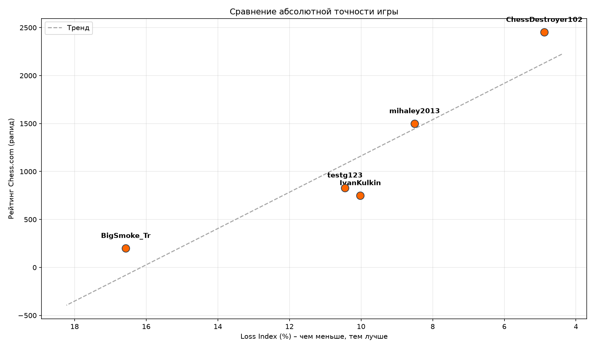

# ♟️ MQ‑Chess – Хватит бояться кнопки «Новая игра»

[](https://opensource.org/licenses/MIT)
[](https://www.python.org/)
[](https://stockfishchess.org/)

**Твой рейтинг врет. Я создал метрику, которая говорит правду.**

---

## Это было и со мной

Ты сидишь перед монитором. Только что закончилась партия. Ты сделал 30 хороших ходов, переиграл соперника по дебюту, выдержал атаку в миттельшпиле... но на 31-м в цейтноте зевнул вилку. 

Рейтинг падает на -15. 

Теперь ты боишься нажать кнопку **«Новая игра»**. Потому что следующее поражение уронит тебя еще ниже, и весь вечер будет насмарку.

**Я создал MQ‑Chess, чтобы ты нажимал эту кнопку без страха.**

Потому что я сам устал бояться. Я понял: поражение — это не всегда плохая игра. А победа — не всегда хорошая. Мой инструмент смотрит **сквозь** результат. Он оценивает **качество твоей мысли**, а не цифру в таблице лидеров.

---

## 📊 Что такое Loss Index (и почему это снимает стресс)

**Loss Index** — это средняя потеря шансов на победу за один ход. 

Грубо говоря, это оценка того, **насколько ты был близок к идеальной игре** в каждой конкретной позиции. 


| Loss Index | Уровень игры |
|------------|--------------|
| **0–2%**   | 🦾 Играешь как Stockfish (идеал) |
| **2–4%**   | 🏆 Гроссмейстерский уровень |
| **4–7%**   | 🎯 КМС / Сильный любитель |
| **7–12%**  | 🏛️ Клубный игрок |
| **>20%**   | 🚨 Пора открывать учебник |

**Как это меняет твою жизнь:**

- ✅ Ты проиграл, но твой Loss Index = 4%? Поздравляю, ты сыграл **как гроссмейстер**. Просто не повезло. Иди и играй следующую партию с чистой совестью.
- ✅ Ты выиграл, но твой Loss Index = 18%? Тебе просто повезло с зевком соперника. Радоваться нечему, есть над чем работать.
- ✅ Ты больше не зависишь от капризного Elo. Ты зависишь только от **качества своих решений**.

---

## 🔬 Математика (для гиков, но очень простая)

Большинство метрик (вроде ACPL на Chess.com) просто считают среднюю потерю в пешках. Это глупо, потому что потеря 50 пешек в сложной позиции (где 30 ходов) — это простительно, а потеря 50 пешек в эндшпиле (где 3 хода) — это катастрофа.

**Мой алгоритм это учитывает:**

1.  Для каждого твоего хода Stockfish считает лучший ход и твой ход в сантипешках.
2.  Я перевожу это в **шансы на победу** по формуле Lichess:
    \[
    W(cp) = \frac{2}{1 + e^{-0.003624 \cdot cp}} - 1
    \]
3.  Считаю потерю шансов: **deltaW = |W(best) — W(played)|**.
4.  Добавляю **вес сложности (Шеннона)**: **weight = ln(legalMoves + 1)**. 
    *   Много ходов → сложно → штраф маленький.
    *   Мало ходов → просто → штраф огромный.
5.  Итог: **Loss Index = (Σ deltaW * weight) / Σ weight * 100%**.

---

## 🚀 Установка (Arch / Любой Linux)

Всего 5 команд, и ты забудешь о рейтинговой тревоге.

```bash
### 📦 Общие шаги
- Установи Python 3.9+, Git, компилятор C++ (g++ или clang).
- Установи Stockfish (движок для анализа).

### 🐧 Linux (Arch, Ubuntu, Debian, Fedora)

```bash
# Arch
sudo pacman -S stockfish gcc python python-pip
# Ubuntu/Debian
sudo apt install stockfish g++ python3 python3-pip
# Fedora
sudo dnf install stockfish gcc-c++ python3 python3-pip

git clone https://github.com/vansGAMee/MQ-Chess.git
cd MQ-Chess
python -m venv venv
source venv/bin/activate
pip install -r requirements.txt
g++ -shared -fPIC -o lib/libanalyzer.so libanalyzer.cpp -O3
python scripts/main.py ТвойНикНаChessCom
------------------------------
Windows (через WSL2 — обязательно)
# В PowerShell от имени администратора:
wsl --install -d Ubuntu
# Запусти Ubuntu из меню «Пуск» и внутри выполни команды для Linux (см. выше)
```

📈 
## Хочешь узнать, кто из твоей шахматной компании играет реально чисто, а кто просто набирает очки за счет везения?

Отредактируй список в scripts/compare.py и запусти:

bash
python scripts/compare.py
Скрипт построит график, где по оси X — твой Loss Index (чем левее, тем ты сильнее), а по оси Y — рейтинг Chess.com. Тренд четко покажет, что рейтинг — это не всегда про мастерство.

🧠 Моя философия
Я не пытаюсь заменить рейтинг. Рейтинг нужен для поиска соперников.

Но когда ты садишься играть, ты должен думать о позиции, а не о цифре.

MQ-Chess возвращает тебе кайф от шахмат. Ты перестаешь трястись над каждым пунктом Elo и начинаешь кайфовать от правильных решений. Анализируя свои партии через эту метрику, ты увидишь свой реальный прогресс за месяц, даже если рейтинг стоит на месте.

«Я перестал бояться нажимать "Новая игра". Потому что теперь я знаю: даже если я проиграю, но мой индекс будет низким — я вырос как игрок».
```
🗂️ Структура проекта
text
MQ-Chess/
├── mq_chess/          # Ядро системы
│   ├── config.py      # Настройки
│   ├── common.py      # Связь с C++ и логика
│   ├── api.py         # Скачивание с Chess.com
│   └── analyzer.py    # Красивые графики
├── scripts/           # То, что ты запускаешь
│   ├── main.py        # Для одного игрока
│   └── compare.py     # Для сравнения
├── data/              # Твои калибровочные данные
├── lib/               # Скомпилированная библиотека
├── requirements.txt
├── LICENSE
└── README.md
📜 Лицензия
MIT — бери, пользуйся, встраивай в свои продукты. Делай мир шахмат честнее.
```
✍️ Автор
Ivan Kulkin — такой же любитель, как и ты, который устал бояться кнопки «Новая игра».


⭐ Если этот проект поможет тебе хотя бы раз нажать «Новая игра» без дрожи в коленках — поставь звезду на GitHub.
Поделись с другом, который тоже боится проигрывать. Вместе мы победим рейтинговую зависимость! ♟️🔥